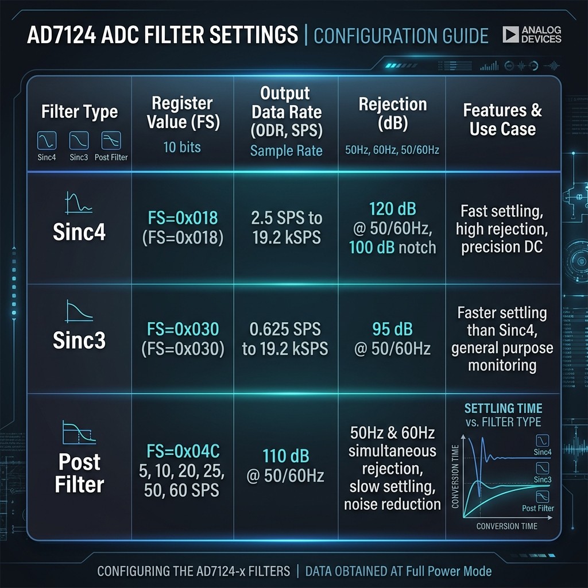

# AD7124 STM32 C Driver

A lightweight, robust, pure C port of the excellent [epsilonrt/ad7124](https://github.com/epsilonrt/ad7124) Arduino library, adapted and optimized for **STM32 microcontrollers** using the **STM32Cube HAL**.

This driver supports the Analog Devices **AD7124-4** and **AD7124-8** 24-bit Sigma-Delta ADCs, enabling high-precision measurement acquisition with minimal CPU overhead.

---

## Features

- **STM32 HAL Integration:** Seamlessly communicates via standard `HAL_SPI_Transmit` and `HAL_SPI_Receive` API.
- **Hardware/Software CS Pin Control:** Features customizable multiple chip-select configurations.
- **Dynamic Channel Configuration:** Dynamically enable or disable channels without corrupting input pin configurations or setups.
- **Single Conversion ADC Reads:** Fully implemented, safe `read(channel)` sequence that enables a channel, samples, waits for completion, retrieves the 24-bit data register, and restores channel state.
- **24-bit Offset & Gain Calibration:** Fully supports reading and writing full 24-bit calibration coefficients.
- **Robust Built-in CRC-8 Validation:** Real-time data validation and error-checking for high-reliability environments.
- **State Corruption Prevention:** Safe non-destructive bitwise updates to keep local register caches in perfect sync with the ADC hardware.

---

## Getting Started

### 1. STM32CubeMX SPI Configuration
To communicate with the AD7124, configure your SPI peripheral in STM32CubeMX with the following parameters:
- **Frame Format:** Motorola
- **Data Size:** 8 Bits
- **First Bit:** MSB First
- **Clock Polarity (CPOL):** High (1) — *AD7124 SPI Mode 3*
- **Clock Phase (CPHA):** 2 Edge (1) — *AD7124 SPI Mode 3*
- **Chip Select (NSS):** Software-controlled (set CS pins manually as GPIO outputs)

### 2. Upstream Peripheral Naming
By default, the driver communicates using the `hspi4` SPI handle and expects CS pins configured with the prefixes `SPI4_CS_Pin`/`SPI4_CS_GPIO_Port` in `main.h`.

*If your STM32 project uses a different SPI peripheral (e.g., SPI1 or SPI2), declare your own handle in `main.h` or modify `ad7124-driver.h` / `ad7124-driver.c` to bind to your specific peripheral handle (e.g., `&hspi1`).*

---

## Code Example

Below is a typical setup and reading sequence in your `main.c`:

```c
#include "ad7124.h"

int main(void) {
    // 1. Initialize system, GPIOs, and SPI
    HAL_Init();
    SystemClock_Config();
    MX_GPIO_Init();
    MX_SPI4_Init();

    // 2. Initialize AD7124 Driver
    if (begin() < 0) {
        // Initialization/Power-on timeout failed!
        Error_Handler();
    }

    // 3. Configure Setup 0 and 1
    // Setup ID: 0, Ref: Internal (2.5V), PGA: Gain 16, Polarity: Bipolar, Burnout: Off
    setConfig(0, RefInternal, Pga16, true, BurnoutOff);
    // Setup ID: 1, Ref: Internal (2.5V), PGA: Gain 16, Polarity: Bipolar, Burnout: Off
    setConfig(1, RefInternal, Pga16, true, BurnoutOff);

    // Configure filter for Setup 0 and 1
    // Setup ID: 0, Filter Type: Sinc4, FS (Data Rate): 384, Postfilter: Off, Rej60: true, Single Cycle: true
    setConfigFilter(0, Sinc4Filter, 384, NoPostFilter, true, true);
    // Setup ID: 0, Filter Type: Sinc4, FS (Data Rate): 384, Postfilter: Off, Rej60: true, Single Cycle: true
    setConfigFilter(1, Sinc4Filter, 384, NoPostFilter, true, true);

    // 4. Map i) Channel 0 to Setup 0, ii) Channel 1 to Setup 1 and Analog Inputs
    // Channel ID: 0, Setup ID: 0, Positive input: AIN2, Negative input: AIN3, Enable: false (read() enables on-demand)
    setChannel(0, 0, AIN2Input, AIN3Input, false);
    // Channel ID: 1, Setup ID: 1, Positive input: AIN4, Negative input: AIN5, Enable: false (read() enables on-demand)
    setChannel(1, 1, AIN4Input, AIN5Input, false);

    //
    (void)IntCalibration(Current1000uA);

    while (1) {
        // 5. Read Sample from Channel 0
        long raw_sample = read(0);
        
        if (raw_sample >= 0) {
            // Convert raw 24-bit two's complement value to voltage
            // gain = 16, vref = 2.5V, bipolar = true
            double voltage = toVoltage(raw_sample, 16, 2.5, true);
            
            // Print or process the voltage
            printf("Voltage: %f V\n", voltage);
        } else {
            // Read Error
            printf("Error reading channel: %ld\n", raw_sample);
        }

        HAL_Delay(1000); // Wait 1 second
    }
}
```

---

## AD7124 Filter Settings & Datasheets

For complete register maps, noise tables, and performance specs, reference the official product pages and datasheets:
*   [Analog Devices AD7124-4 Datasheet (PDF)](https://www.analog.com/en/products/ad7124-4.html)
*   [Analog Devices AD7124-8 Datasheet (PDF)](https://www.analog.com/en/products/ad7124-8.html)

### Filter Settings Reference Table
Below is a summarized view of standard filter configurations and their primary use cases:

| Filter Type | FS Register Range | Settling Time ($t_{SETTLE}$) | Features / Noise Rejection |
| :--- | :--- | :--- | :--- |
| **Sinc4** | 1 to 2047 | $\frac{4}{f_{ADC}}$ | Best noise rejection; default mode upon reset. |
| **Sinc3** | 1 to 2047 | $\frac{3}{f_{ADC}}$ | Good balance of settling speed and rejection. |
| **Sinc4/3 Fast** | 1 to 2047 | $\frac{1}{f_{ADC}}$ | Single-cycle settling (zero-latency). |
| **Post Filter** | N/A | $\frac{1}{f_{ADC}}$ | Dynamic simultaneous 50 Hz & 60 Hz rejection. |

### Visual Filter Configurations Infographic


---

## License & Attribution

This project is a port of the `ad7124` library created by **epsilonrt**.
In compliance with the original upstream project, this library is distributed under the **CeCILL Free Software License Version 2.1** (a copyleft free software license fully compatible with the GNU GPL).

Please see the original license terms inside the upstream project or reference `CeCILL-2.1` for reuse and distribution guidelines.
